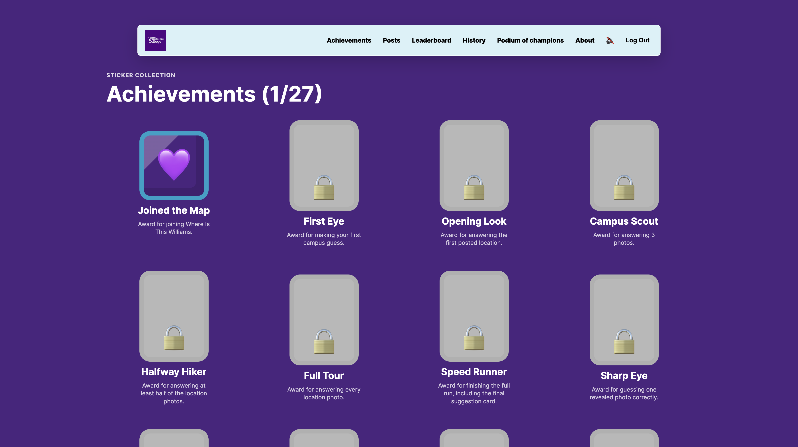
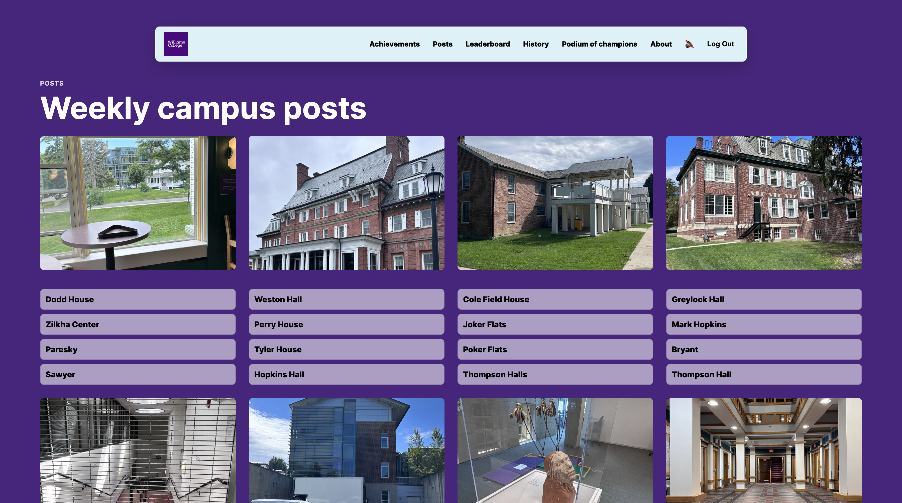
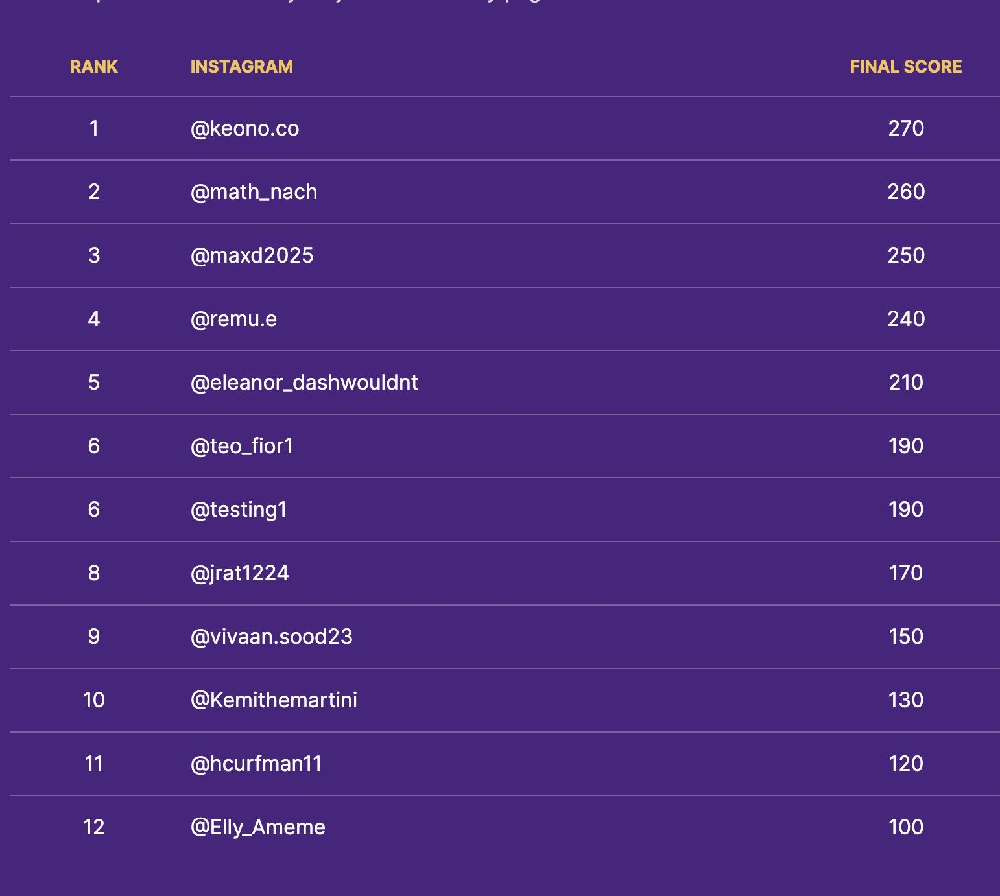

# Where Is This Williams

By Alex

Where Is This Williams is a campus photo guessing game made for Williams College students. Students enter their Williams email and Instagram username, look through weekly campus photos, choose where each photo was taken, and submit their answers. The app records scores, updates the leaderboard, keeps each player's voting history, and shows achievements as players participate.

## How Williams Students Use It

Students open the site, enter their Williams email and Instagram username, then play through the Posts page. Each photo has multiple campus-location options. After submitting, players cannot vote again with the same account, and their score is saved for the leaderboard.

The leaderboard shows public scores by Instagram username. Each player can also check their own history page to see the guesses they submitted.

## Screenshots

### Achievements



### Weekly Campus Posts



### Leaderboard



## Main Features

- Williams email and Instagram username entry.
- Weekly campus photo guessing.
- One final submission per player.
- Saved scores and leaderboard updates.
- Personal voting history.
- Achievement stickers for participation and progress.
- Podium of Champions for the top three players.
- Supabase-backed storage for scores and player data.

## Running Locally

```bash
npm start
```

Then open:

```text
http://localhost:3000/login.html
```

## Deployment

The app is designed to run on Render with Supabase environment variables configured:

```text
SUPABASE_URL
SUPABASE_ANON_KEY
SUPABASE_SERVICE_ROLE_KEY
```

Those variables allow player records, votes, scores, and leaderboard data to stay saved after redeploys.
